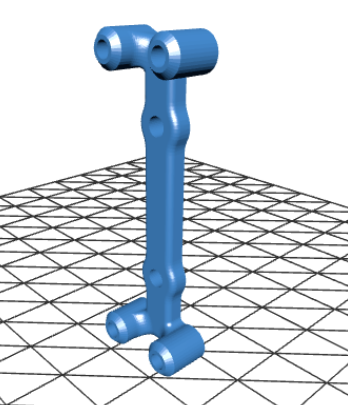
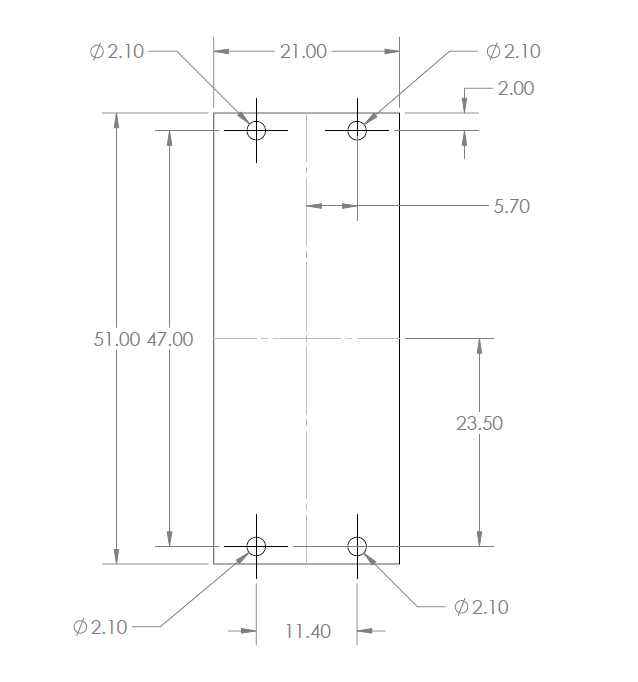
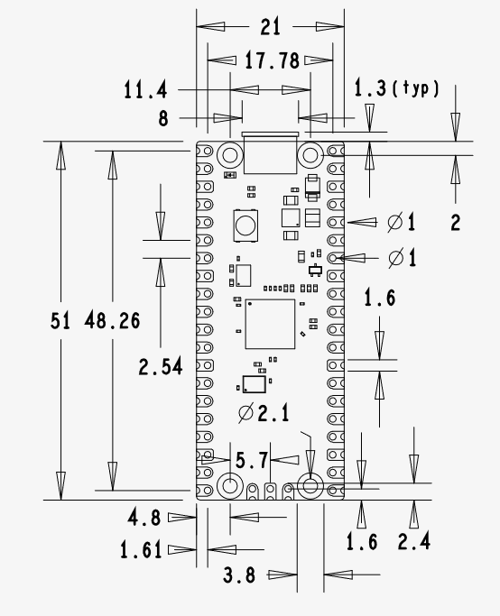

# [Pi Pico Bracket](https://github.com/lafefspietz/pi-pico-bracket)

 - [bracket.STL](bracket.STL)
 - [M2 Thread Inserts](https://www.amazon.com/dp/B0CS6XJSSL)
 - [M2 x 4 mm Phillips Pan Head Screws](https://www.amazon.com/dp/B07HFYZ9YM)
 - [4-40 Phillips Pan Head Screws, 1/4"](https://www.mcmaster.com/90272A106/)

